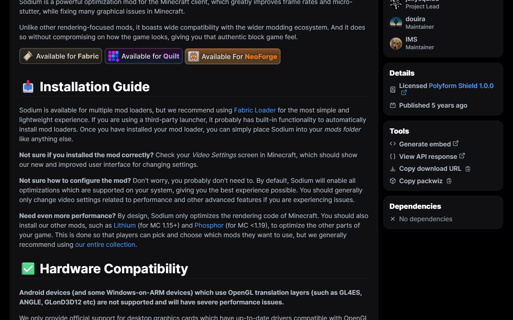
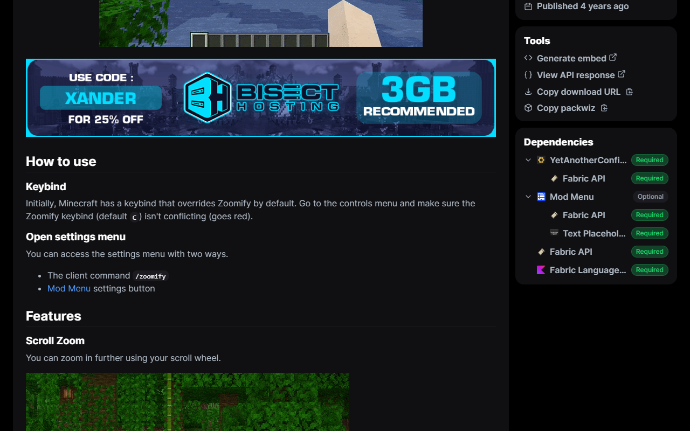

#  Modrinth Extras

A browser extension adding unofficial extra features to the [Modrinth](https://modrinth.com) website.


## 🚀 Installation

Install from your browser's extension store:

- **[Chrome Web Store](#)**
- **[Firefox Add-Ons](#)**
- **[Edge Add-Ons](#)**

Prefer to build from source? See [Building from source](#building-from-source) below.

## 🔒 Building from source

If you don't want to trust the store release, you can build the extension yourself directly from the source code and verify it matches what's in this repository.

**Prerequisites:** [Node.js](https://nodejs.org) and [pnpm](https://pnpm.io)

```bash
# Clone and check out the version you want to verify (e.g. v1.0.6)
git clone https://github.com/creeperkatze/modrinth-extras.git
cd modrinth-extras
git checkout v1.0.6

pnpm install

# Chrome / Edge
pnpm zip

# Firefox
pnpm zip:firefox
```

The resulting zips in `.output/` are identical to those attached to the [GitHub release](https://github.com/creeperkatze/modrinth-extras/releases) for that tag.

**Chrome / Edge:** go to `chrome://extensions/`, enable **Developer mode**, then drag and drop the zip onto the page.

**Firefox:** see the [Development](#development) section below for instructions on loading the zip. Note that Firefox removes the extension on browser restart since it is loaded as a temporary add-on.

## ✨ Features

### Notification Indicator

Adds a live bell icon to the Modrinth header showing your unread notification count. Click it to open a dropdown with your recent unread notifications, accept or decline team/organization invites, mark individual notifications as read, or clear them all at once.


### Tools Sidebar

Adds a tools card to the sidebar on project, user, organization, and collection pages with the following items:

- **Generate embed:** opens [Modfolio](https://modfolio.creeperkatze.de) pre-loaded with the current page URL to generate an embeddable card or badge.
- **View API response:** opens the raw Modrinth API JSON for the current page in a new tab. Works on projects, users, organizations, and collections.

On project pages, two additional developer utilities are shown:

- **Copy download URL:** copies the direct download URL of the project's latest primary file to the clipboard.
- **Copy packwiz:** copies the `packwiz mr add <slug>` command to the clipboard.



### Dependency Sidebar

On project pages, a dependencies card shows the project's full dependency tree. Each dependency can be expanded up to two levels deep to inspect transitive dependencies, with lazy loading on expand.



### More features coming soon™!

## 👨‍💻 Development

### Setup

```bash
git clone https://github.com/creeperkatze/modrinth-extras.git
cd modrinth-extras

pnpm install
```

### Chrome

```bash
pnpm build
```

Then go to `chrome://extensions/`, enable **Developer mode**, click **Load unpacked**, and select the `.output/chrome-mv3` folder. After rebuilding, just click on the reload icon.

### Firefox

```bash
pnpm zip:firefox
```

Then go to `about:debugging#/runtime/this-firefox`, click **Load Temporary Add-on**, and select the zip from the `.output/` folder. After rebuilding, repeat this process.

> [!NOTE]
> `pnpm dev` can also be used during development to automatically create a temporary browser with the extension pre-loaded. Keep in mind that this browser profile is isolated, requiring you to log in each time. This method also causes issues with Modrinth's dependencies.

## 🤝 Contributing

Contributions are always welcome!

Please ensure you run `pnpm lint` before opening a pull request.

## 📜 License

AGPL-3.0
