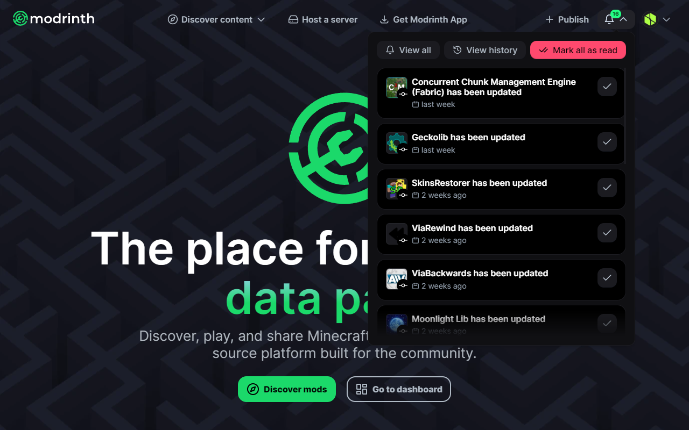
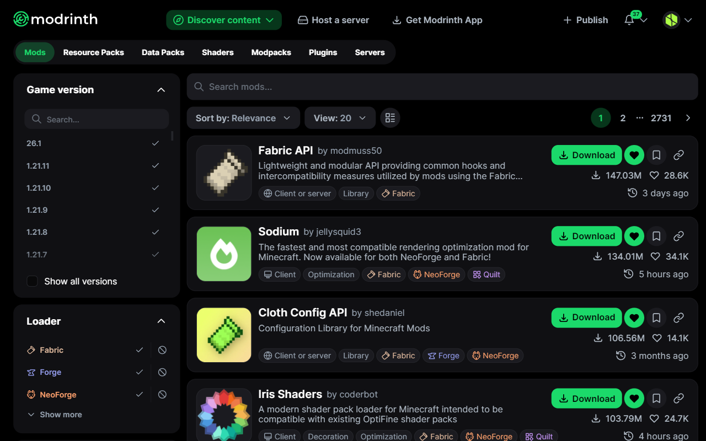

# 

A browser extension that enhances Modrinth on the website and beyond.


[](https://crowdin.com/project/modrinth-extras)

## 🚀 Installation

Install from your browser's extension store:

> [!NOTE]
> Store listings may currently be outdated. For the latest version, install manually from the [GitHub releases](https://github.com/creeperkatze/modrinth-extras/releases).

- **[Chrome Web Store](https://chromewebstore.google.com/detail/modrinth-extras/ajmkilipadfpaefpcjfgnkejalmhdlcj)**
- **[Firefox Add-Ons](https://addons.mozilla.org/firefox/addon/modrinth-extras/)**
- **[Edge Add-Ons](https://microsoftedge.microsoft.com/addons/detail/modrinth-extras/jkfgnimibfpoohbmaibjdjdmfnjmbjcj)**

Or install manually from the latest [GitHub release](https://github.com/creeperkatze/modrinth-extras/releases):

1. Download the zip for your browser from the release assets.
2. **Chrome / Edge:** go to `chrome://extensions/`, enable **Developer mode**, then drag and drop the zip onto the page.
3. **Firefox:** go to `about:debugging#/runtime/this-firefox`, click **Load Temporary Add-on**, and select the zip. Note that Firefox removes the extension on browser restart since it is loaded as a temporary add-on.

Prefer to build from source? See [Building from source](#-building-from-source) below.

## ✨ Features

All features can be individually toggled from the extension popup.


### Notifications

View, manage, and clear unread notifications right in the header without leaving the current page.



### Quick search

Ctrl+K or / for a command palette style search with faceted tags for loaders, versions, categories, and types.


### Project card actions

Download, follow, and save projects right from their project cards.

- **Download:** downloads the latest primary file directly.
- **Follow / Unfollow:** follow or unfollow the project.
- **Save:** save or remove the project from your collections.
- **Copy link:** copy the project's link to your clipboard.



### Activity sparkline

Release activity chart on project pages.


### Tools sidebar

Generate embeds, view raw API responses, copy download URLs and packwiz commands.

- **Generate embed:** opens [Modfolio](https://modfolio.creeperkatze.de) pre-loaded with the current page URL to generate an embeddable card or badge.
- **View API response:** opens the raw Modrinth API JSON for the current page in a new tab.

On project pages, two additional developer utilities are shown:

- **Copy download URL:** copies the direct download URL of the project's latest primary file to the clipboard.
- **Copy packwiz:** copies the `packwiz mr add <slug>` command to the clipboard.

### Dependency sidebar

Collapsible dependency tree on project pages.

### GitHub sidebar

Stars, issues, pull requests, and forks for linked repositories.

### Discord sidebar

Server name, description, member count, and online count for linked Discord servers.


### Notification badge

Up-to-date unread notification count as a badge on the extension icon.

### Desktop notifications

Operating system notifications for your Modrinth notifications.

### CurseForge redirect

Redirect CurseForge project pages to Modrinth when available.

## 🔒 Building from source

If you don't want to trust the store release, you can build the extension yourself directly from the source code and verify it matches what's in this repository.

**Prerequisites:** [Node.js](https://nodejs.org) and [pnpm](https://pnpm.io)

```bash
# Clone and check out the version you want to verify (e.g. v1.0.11)
git clone --recurse-submodules https://github.com/creeperkatze/modrinth-extras.git
cd modrinth-extras
git checkout v1.0.11

pnpm install

# Chrome / Edge
pnpm zip

# Firefox
pnpm zip:firefox
```

The resulting zips in `.output/` are identical to those attached to the [GitHub release](https://github.com/creeperkatze/modrinth-extras/releases) for that tag. See the [Installation](#-installation) section for instructions on loading the zip in your browser.

## 👨‍💻 Development

### Setup

> [!IMPORTANT]
> The `--recurse-submodules` flag is required as the project imports packages from the [modrinth](https://github.com/modrinth/code) monorepo as a git submodule.

```bash
git clone --recurse-submodules https://github.com/creeperkatze/modrinth-extras.git
cd modrinth-extras

pnpm install
```

### Chrome

```bash
pnpm build
```

Then go to `chrome://extensions/`, enable **Developer mode**, click **Load unpacked**, and select the `.output/chrome-mv3` folder. After rebuilding, just click on the reload icon.

### Firefox

```bash
pnpm zip:firefox
```

Then go to `about:debugging#/runtime/this-firefox`, click **Load Temporary Add-on**, and select the zip from the `.output/` folder. After rebuilding, repeat this process.

> [!NOTE]
> `pnpm dev` can also be used during development to automatically create a temporary browser with the extension pre-loaded. Keep in mind that this browser profile is isolated, requiring you to log in each time. This method also causes issues with Modrinth's dependencies.

## 🤝 Contributing

Contributions are always welcome!

Please ensure you run `pnpm lint` before opening a pull request.

## 🌐 Translating

Translations are managed on [Crowdin](https://crowdin.com/project/modrinth-extras). You can contribute without any technical knowledge, just pick your language and start translating.

New translations are automatically pulled every Monday.

## 📜 License

AGPL-3.0
